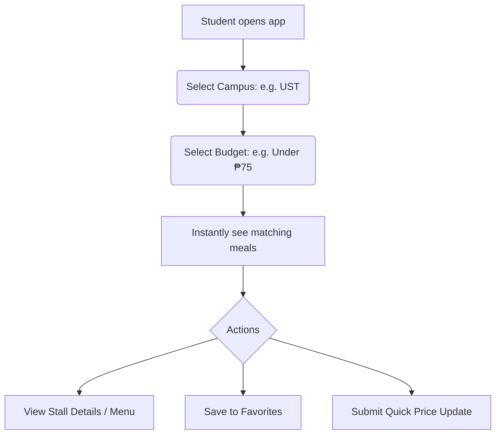

# U-BudgetBites MVP Implementation Plan (Revised for Pitch & Fast Execution)

To ensure this MVP is completed rapidly and is 100% reliable during a live pitch, we have simplified the technically complex elements. The focus is strictly on the core question: **"What can I eat near my campus with my remaining budget?"**

---

## Pitch-Focused Simplifications (Feasibility Check)

> [!IMPORTANT]
> **1. Seed Data & Local Database Default (Zero Config)**
> * **Challenge:** Cold starts or slow Firebase database loads can ruin a live presentation.
> * **Solution:** We will run by default on a rich, pre-seeded local storage dataset of U-Belt stalls (e.g., Ate Rica's Bacsilog near UST, Dimsum Treats near FEU). It works instantly with zero API keys or configuration needed.
> * **Firebase Bridge:** Standard Firebase config is supported via `.env` but is completely optional for the pitch.

> [!TIP]
> **2. Smart Photo Library vs. File Uploads**
> * **Challenge:** Uploading raw camera photos during a pitch is slow and can break due to network issues or file sizes.
> * **Solution:** Submissions will use a pre-selected library of modern food icons/images, or dynamic placeholder category cards (e.g., Rice Meal, Dessert, Drink). This guarantees beautiful visual layouts.

> [!NOTE]
> **3. External Location Routing vs. Map SDKs**
> * **Challenge:** Embedded Map APIs (Google Maps/Mapbox) require active billing, API keys, and slow down page load.
> * **Solution:** We will use direct `https://maps.google.com/?q=[Stall+Name+Campus]` query links. This opens the user's native Google Maps/Apple Maps app instantly, which is highly practical and risk-free.

---

## Core MVP User Flow (Pitch Ready)



---

## Proposed Folder Structure

```
src/
├── components/
│   ├── ui/          # Buttons, Inputs, Dialogs, Toasts, Stars
│   ├── layout/      # Navbar (with mobile bottom-bar navigation)
│   └── cards/       # FoodCard, StallCard (clean, glassmorphism layouts)
├── pages/
│   ├── Home.tsx     # Fast campus & budget selectors
│   ├── Search.tsx   # Direct name search
│   ├── MealDetails.tsx # Detail page with quick price updates & reviews
│   ├── StallDetails.tsx # Stall page, menu, opening hours, Map links
│   ├── Favorites.tsx # Locally saved bookmarked items
│   ├── Profile.tsx  # User stats and contribution logs
│   └── Login.tsx    # Single-tap Student profile creation
├── services/
│   ├── db.ts        # Database access (local storage seeded data + Firebase hooks)
│   └── auth.ts      # Authentication handler
  └── constants/       # Pre-seeded campuses, stalls, and menus
```

---

## Verification & Pitch Readiness Plan

### Live Pitch Checks
1. **Offline/Local Launch:** Confirm the app runs locally without network dependencies.
2. **Speed Run:** Verify a user can find a ₱60 meal near UST within 3 clicks.
3. **Price Update Demo:** Demonstrate changing a meal price from ₱60 to ₱65 and verify the change reflects instantly on the dashboard.
